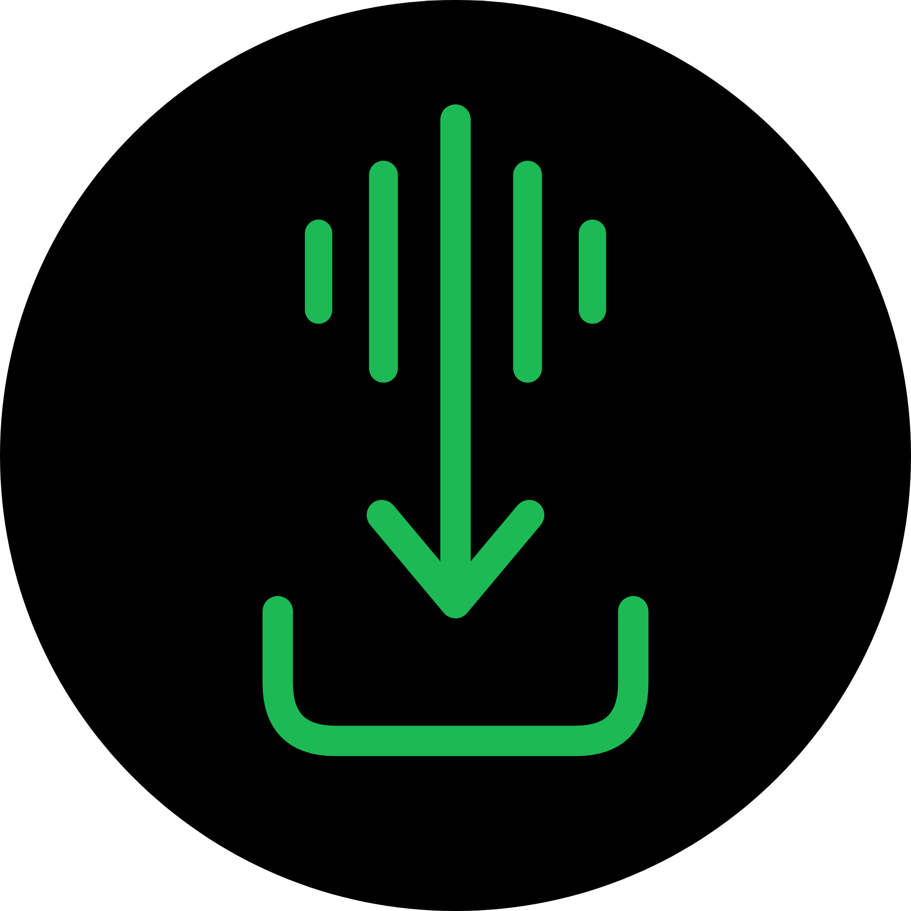

# Mini's Repo

### Premium Tweaked IPA Library for iOS 15+

---

## Repository Source

Copy and paste this link directly into your app manager:

`https://OofMini.github.io/Minis-Repo/mini.json`

---

## App Collection

|                                                       Icon                                                        | App Name            | Version  | Description                                                                       |
| :---------------------------------------------------------------------------------------------------------------: | :------------------ | :------- | :-------------------------------------------------------------------------------- |
|       | **EeveeSpotify** | v9.1.60  | Premium Spotify client with lyrics, no ads, and high-quality audio streaming.     |
|  | **YTLite** | v21.16.2 | Lightweight YouTube tweak with background playback, ad-blocking, and PiP.         |
|       | **YTMusicUltimate** | v9.29  | Unlocked YouTube Music experience with background audio and premium features.     |
|        | **NeoFreeBird** | v12.10   | Enhanced X (Twitter) client with ad removal and video downloading capabilities.   |
|             | **InShot Pro** | v1.98.0  | Professional video editor with all filters, effects, and export options unlocked. |
|          | **Reface Pro** | v6.9.1   | Advanced AI face-swapping tool with premium templates and features enabled.       |
|           | **iTorrent** | v2.2.0   | A robust, native BitTorrent client for iOS with background downloading support.   |
|      | **LiveContainer Nightly** | v3.8.0   | Run JIT-dependent apps without a computer using advanced containerization (nightly build). |
|        | **NFB Login** | v9.67   | Login fix for tweaked X — install and sign in first, then install X over the top. |
|     | **SpotiFLAC** | v4.8.0  | Lossless music downloader (FLAC) — pair it with the Cosmos music player.          |
|  | **MiniStore** | v0.6.4  | Alternative app store for iOS — a SideStore fork to install and update apps wirelessly, no computer required. |

---

## Licensing & Ownership

The GitHub Pages site, its source code, the automation scripts, and the structure
of the source manifest are licensed under the [Apache License 2.0](LICENSE).

**No `.ipa` files are hosted in this repository.** The manifest contains links to
application packages stored elsewhere as release assets; your sideloading client
downloads them directly from those locations. They are never served from, bundled
with, or contained in this repository or the GitHub Pages site built from it.

None of those applications are owned by this project, and no ownership of or
affiliation with them is claimed. Each remains the property of its respective
developer or rights holder, and its use is governed by that party's terms — not
by the licence above. App icons, screenshots, product names, and logos belong to
their respective owners and appear only to identify the software each entry
refers to; their presence implies no endorsement or partnership.

Everything here is provided as is, with no warranty. The linked applications are
not built, signed, reviewed, or audited by this project — install at your own
risk. See [NOTICE](NOTICE) for the full statement, including how to request a
takedown.

---

  Maintained by <a href="https://github.com/OofMini">OofMini</a> · Powered by Node.js & GitHub Actions

